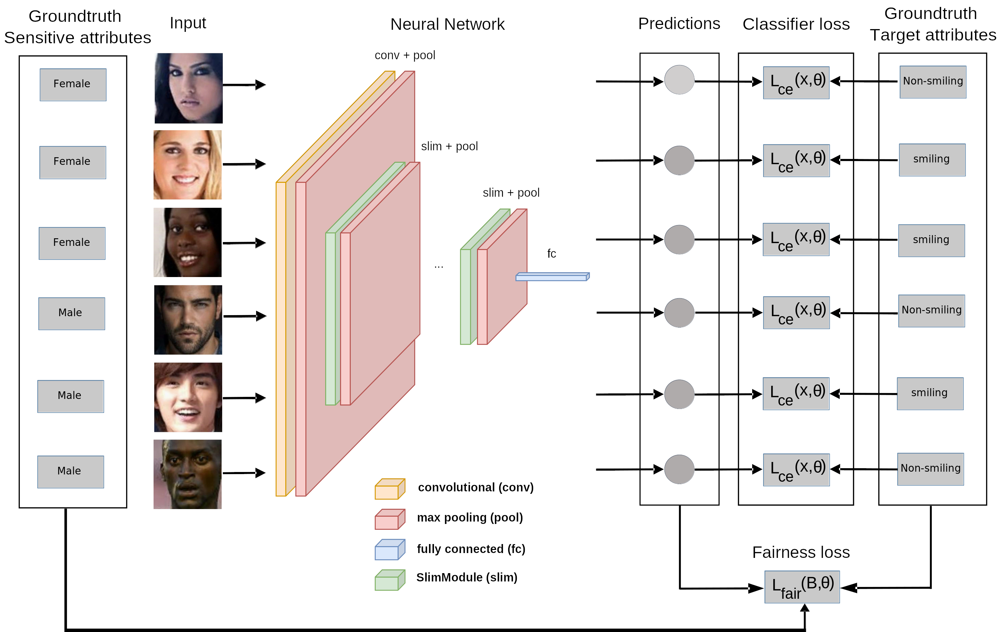

# **FVAP**

A straightforward training system to improve the algorithmic fairness of visual attribute prediction networks



> [Enhancing **F**airness of **V**isual **A**ttribute **P**redictors](https://arxiv.org/abs/2207.05727), <br>
> [_Tobias Hänel_](https://arxiv.org/search/cs?searchtype=author&query=Hänel%2C+Tobias), [_Nishant Kumar_](https://arxiv.org/search/cs?searchtype=author&query=Kumar%2C+Nishant), [_Dmitrij Schlesinger_](https://arxiv.org/search/cs?searchtype=author&query=Schlesinger%2C+Dmitrij), [_Mengze Li_](https://arxiv.org/search/cs?searchtype=author&query=Li%2C+Mengze), [_Erdem Ünal_](https://arxiv.org/search/cs?searchtype=author&query=Ünal%2C+Erdem), [_Abouzar Eslami_](https://arxiv.org/search/cs?searchtype=author&query=Eslami%2C+Abouzar), [_Stefan Gumhold_](https://arxiv.org/search/cs?searchtype=author&query=Gumhold%2C+Stefan), <br>
> *ACCV2022 ([arXiv:2207.05727](https://arxiv.org/abs/2207.05727)*)

## Abstract
Our new training procedure improves the fairness of image classification models w.r.t. to sensitive attributes such as
gender, age, and ethnicity. We add a weighted fairness loss to the standard cross-entropy loss during mini-batch
gradient descent. It estimates the fairness of the model’s  predictions based on the sensitive attributes and the
predicted and ground-truth target attributes from the samples within each batch.

## News
* (2022/09/16) The ACCV2022 program chairs accepted our paper

## Requirements

## Installation
### Repository Setup
* Clone this repository to your desired location for the project root directory `$PROJ_ROOT`<br>
``$ export PROJ_ROOT=/path/to/proj/root``<br>
``$ git clone https://github.com/nish03/FVAP.git $PROJ_ROOT``

### Data preparation
Each dataset will be stored in the `datasets` directory in the project root `$PROJ_ROOT`
* **CelebA** can be obtained from the official [webpage](https://mmlab.ie.cuhk.edu.hk/projects/CelebA.html). 
Select the [Aligned&Cropped Images](https://drive.google.com/drive/folders/0B7EVK8r0v71pWEZsZE9oNnFzTm8?resourcekey=0-5BR16BdXnb8hVj6CNHKzLg&usp=sharing),
download `Img/image_align_celeba.zip` and extract the contained images to `datasets/CelebA/celeba/img_align_celeba`. Download the annotation files `Anno/*.txt` and store them in `datasets/CelebA/celeba`.
* **SIIM-ISIC Melanoma Classification** can be obtained from the Kaggle competition [webpage](https://www.kaggle.com/competitions/siim-isic-melanoma-classification/data). Download the `jpeg` directory and extract the contained contents to `datasets/SIIM-ISIC-Melanoma/jpeg`. Download `train.csv` and store it in `datasets/SIIM-ISIC-Melanoma/train.csv`
* **UTKFace** can be obtained from the official [webpage](https://susanqq.github.io/UTKFace/). Select the [Aligned&Cropped Faces](https://drive.google.com/drive/folders/0BxYys69jI14kU0I1YUQyY1ZDRUE?resourcekey=0-01Pth1hq20K4kuGVkp3oBw), download `UTKFace.tar.gz` and extract the contained images to `datasets/UTKFace`

After you are finished with the data preparation process your `datasets` directory should look like this:

```
[datasets]
   ┣━━[CelebA]
   ┃     ┗━━[celeba]
   ┃           ┣━━[img_align_celeba]
   ┃           ┃     ┣━━ 000001.jpg
   ┃           ┃     ┣━━ 000002.jpg
   ┃           ┃     ┣━━ ...
   ┃           ┃     ┗━━ 202599.jpg
   ┃           ┣━━ identity_CelebA.txt
   ┃           ┣━━ list_attr_celeba.txt
   ┃           ┣━━ list_bbox_celeba.txt
   ┃           ┣━━ list_eval_partition.txt
   ┃           ┗━━ list_landmarks_align_celeba.txt
   ┃━━[SIIM-ISIC-Melanoma]
   ┃     ┣━━[jpeg]
   ┃     ┃     ┣━━[test]
   ┃     ┃     ┃     ┣━━ ISIC_0052060.jpg
   ┃     ┃     ┃     ┣━━ ISIC_0052349.jpg
   ┃     ┃     ┃     ┣━━ ...
   ┃     ┃     ┃     ┗━━ ISIC_9999302.jpg
   ┃     ┃     ┗━━[train]
   ┃     ┃           ┣━━ ISIC_0015719.jpg
   ┃     ┃           ┣━━ ISIC_0052212.jpg
   ┃     ┃           ┣━━ ...
   ┃     ┃           ┗━━ ISIC_9999806.jpg
   ┃     ┣━━ test.csv
   ┃     ┗━━ train.csv
   ┗━━[UTKFace]
         ┣━━ 1_0_0_20161219140623097.jpg.chip.jpg
         ┣━━ 1_0_0_20161219140627985.jpg.chip.jpg
         ┣━━ ...
         ┗━━ 116_1_3_20170120134744096.jpg.chip.jpg
```

### Python package installation
This project was developed under Linux with Python 3.9.6 and GCC 11.2.0 and CometML. <br>
The ```requirements.txt``` file contains the used python package versions. <br>

Run ```pip install -r requirements.txt``` to install them. <br>
Feel free to try out newer versions and let us know if there  are any incompatibilities.

### CometML Configuration
Create a CometML configuration file (.comet.config) in the project root directory `$PROJ_ROOT`.

See https://www.comet.com/docs/v2/guides/tracking-ml-training/configuring-comet/#configure-comet-using-the-comet-config-file for more information.

## Training
1. Write argument files (*.args) with your desired choice of hyperparameters. <br>
These files may contain the following parameters:
```
--batch_size: int = 256
  Batch size for training and evaluation (should be large for good fairness estimates)
--epoch_count: int = 15
  Number of epochs for training
--learning_rate: float = 1e-3
  Learning rate for the optimization procedure
--learning_rate_scheduler: str = "none"
  Learning rate scheduling method ("none" or "reduce_lr_on_plateau") for the optimization procedure
--reduce_lr_on_plateau_factor: float = 0.5
  ReduceLROnPlateau factor
--reduce_lr_on_plateau_patience: int = 5
  ReduceLROnPlateau patience
--dataset: str = "celeba"
  Dataset ("celeba", "siim_isic_melanoma", "utkface")
--model: str = "slimcnn"
  Model type ("efficientnet-b0", "efficientnet-b1", "efficientnet-b2", "efficientnet-b3", "efficientnet-b4",
              "efficientnet-b5", "efficientnet-b6", "efficientnet-b7" or "slimcnn")
--optimizer: str = "adam"
  Optimizer ("adam", "sgd")
--adam_beta_1: float = 0.9
  Adam optimizer beta_1 parameter
--adam_beta_2: float = 0.999
  Adam optimizer beta_2 parameter
--sgd_momentum: float = 0.0
  SGD momentum parameter
--sensitive_attribute_index: int
  Index of the sensitive attribute
--target_attribute_index: int
  Index of the target attribute
--fair_loss_weight: float = 1
  Weighting coefficient for the fair loss term
--fair_loss_type: str = "intersection_over_union_conditioned"
  Fair loss type ("demographic_parity", "equalized_odds", "intersection_over_union_paired",
                  "intersection_over_union_conditioned", "mutual_information_dp", "mutual_information_eo")
--pretrained_model: str
  (Optional) path to a pretrained model state file (*.pt) to reuse weights from a previous training procedure
--class_weights: str = "none"
  Class weighting method for the cross entropy loss ("none", "balanced", "ins", "isns", "ens")
--ens_beta: float = 0.99
  ENS class weighting beta parameter
```
Example arguments file for training a fair EfficientNet-B1 (`efficientnet-b1`) model with weights from an unfair pretrained model on the dataset from the SIIM-ISIC-Melanoma Classification Challenge (`siim_isic_melanoma`) for the sensitive attribute age_group (attribute with index 0) and the target attribute diagnosis (attribute with index 1) with the fair conditioned intersection over union loss (`intersection_over_union_conditioned`):
```
--batch_size
256
--epoch_count
25
--learning_rate
1e-03
--dataset
siim_isic_melanoma
--model
efficientnet-b1
--optimizer
adam
--sensitive_attribute_index
0
--target_attribute_index
2
--fair_loss_weight
1.5e+02
--fair_loss_type
intersection_over_union_conditioned
--pretrained_model
experiments/models/unfair_efficientnet-siim_isic_melanoma-target_diagnosis_class_weights_ens_0.9998-best_model.pt
--class_weights
ens
--ens_beta
0.9998
```
2. Run `./main.py ARGS_ROOT_DIR [REL_ARGS_FILE...]` <br>
ARGS_ROOT_DIR - Path to the arguments root directory for the set of experiments <br>
REL_ARGS_FILE - (Optional) Path to one or more the arguments files relative to the arguments root directory <br> All
argument files inside ARGS_ROOT_DIR are used, if no REL_ARGS_FILE is given. Results will be stored in
`experiments/results`.


## Citation
```
@article{haenel2022fvap,
  title = {Enhancing Fairness of Visual Attribute Predictors},
  author = {Hänel, Tobias and Kumar, Nishant and Schlesinger, Dmitrij and Li, Mengze and Ünal, Erdem and Eslami, Abouzar and Gumhold, Stefan},
  doi = {10.48550/ARXIV.2207.05727},
  url = {https://arxiv.org/abs/2207.05727},
  keywords = {Computer Vision and Pattern Recognition (cs.CV), Probability (math.PR), FOS: Computer and information sciences, FOS: Computer and information sciences, FOS: Mathematics, FOS: Mathematics},
  publisher = {arXiv},
  year = {2022},
  copyright = {Creative Commons Attribution 4.0 International}
```