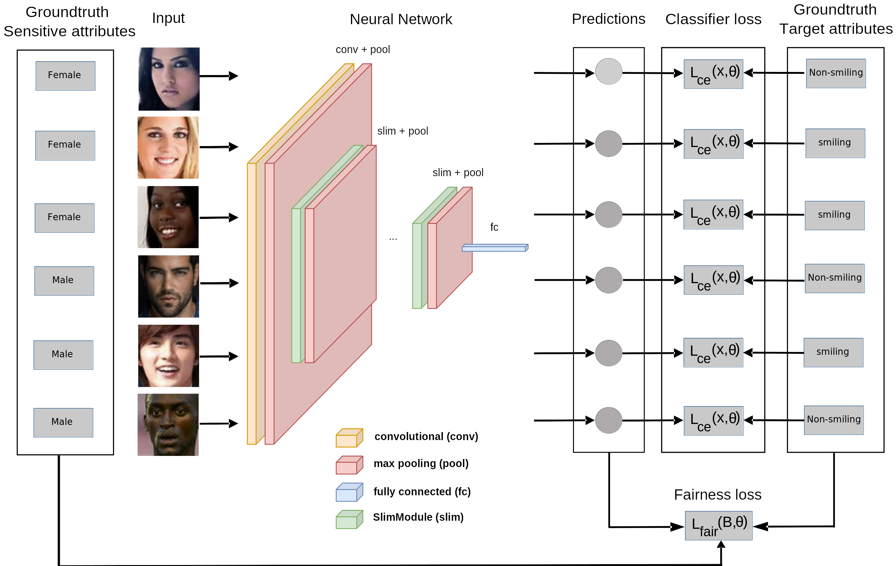

# **FVAP**: Enhancing **F**airness of **V**isual **A**ttribute **P**redictors

This is the publicly available source code of our paper [Enhancing **F**airness of **V**isual **A**ttribute 
**P**redictors](https://arxiv.org/abs/2207.05727).

[_Tobias Hänel_](https://arxiv.org/search/cs?searchtype=author&query=Hänel%2C+Tobias),
[_Nishant Kumar_](https://arxiv.org/search/cs?searchtype=author&query=Kumar%2C+Nishant),
[_Dmitrij Schlesinger_](https://arxiv.org/search/cs?searchtype=author&query=Schlesinger%2C+Dmitrij),
[_Mengze Li_](https://arxiv.org/search/cs?searchtype=author&query=Li%2C+Mengze),
[_Erdem Ünal_](https://arxiv.org/search/cs?searchtype=author&query=Ünal%2C+Erdem),
[_Abouzar Eslami_](https://arxiv.org/search/cs?searchtype=author&query=Eslami%2C+Abouzar),
[_Stefan Gumhold_](https://arxiv.org/search/cs?searchtype=author&query=Gumhold%2C+Stefan)

Our new training procedure improves the fairness of image classification models w.r.t. to sensitive attributes such as
gender, age, and ethnicity. We add a weighted fairness loss to the standard cross-entropy loss during mini-batch
gradient descent. It estimates the fairness of the model’s  predictions based on the sensitive attributes and the
predicted and ground-truth target attributes from the samples within each batch.

[//]: # (## Datasets)

[//]: # ()
[//]: # (We validate our contributions on three data sets. The first study of interest concerns the CelebFaces attributes &#40;)

[//]: # (CelebA&#41; data set [16] which contains more than 200K images of celebrities and manually annotated facial attributes.)

[//]: # (Secondly, we investigate the UTKFace facial image data set [17] which contains over 20K images from a broad range of age)

[//]: # (groups. In addition to the facial images, we perform experiments with a data set from the SIIM-ISIC melanoma)

[//]: # (classification challenge [10] that contains 33k+ skin lesion images.)

[//]: # ()
[//]: # (Our new training procedure that improves the fairness)

[//]: # (of image classification models w.r.t. to sensitive attributes such as gender, age,)

[//]: # (and ethnicity. We add a weighted fairness loss to the standard cross-entropy)

[//]: # (loss during mini-batch gradient descent. It estimates the fairness of the model’s)

[//]: # (predictions based on the sensitive attributes and the predicted and ground-truth)

[//]: # (target attributes from the samples within each batch.)

[//]: # ()
[//]: # ()
[//]: # (### CelebA)

[//]: # ()
[//]: # (### UTKFace)

[//]: # ()
[//]: # (### SIIM-ISIC Melanoma)

[//]: # ()
[//]: # (## Dependencies)

[//]: # ()
[//]: # (##)